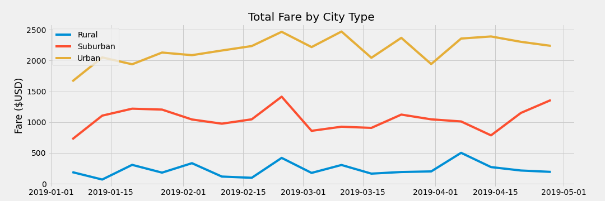

# pyber-analysis

## Overview of Project

### Purpose

The client, V. Isualize, requested a basic analysis of some PyBer ride-sharing data based on city type (urban, suburban, rural) and fare amounts. This will help determine what differences there are, if any, between city types, and how that might affect decisions PyBer leaders make in the future.

## Results

### PyBer Summary DataFrame

Because of the difference in population between urban and rural areas, it is not surprising to find that urban areas have the most rides and drivers (and therefore the highest fare totals) compared to the others. Similarly, the average fares per ride/per driver are higher in rural areas than in urban areas. This is likely due to how spread out rural areas are, leading to longer rides over greater distances and skewing the cost. Riders in urban areas are not likely to need to travel very far because of the close-proximity cities offer.

### Total Fare by City Type

Urban areas provide the most profit, whereas rural areas do not. It appears that uburban areas also generate a substantial amount of revenue, depsite not being the top performer.

## Summary

It is quite clear that the usage of PyBer performs best in urban areas and is inaccessible in rural areas. Here are 3 recommendations that the business might consider in order to resolve some of these differences:
* Determine whether it is important to equitize both rider and driver experience, no matter geographical area. It may not be as profitable to adjust rural fares and pays proportionally to an urban area, but it may attract more business.
* If rural areas are determined to be worth equitizing, lower the base cost of rides in rural areas without decreasing driver pay. This will make it more likely to attract riders in rural areas without also pushing out drivers with too low wages.
* 